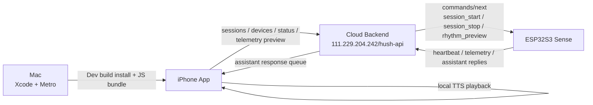

# HUSH

Breathing support app built with Expo + React Native + TypeScript, connected to a cloud backend and a `Seeed XIAO ESP32S3 Sense` hardware device.

HUSH is designed around one core loop:

- the iPhone app presents breathing sessions, trends, device state, and guided UI
- the cloud backend coordinates sessions, hardware commands, telemetry, and assistant messages
- the ESP32 hardware sends 9-axis telemetry, executes vibration cues, and can upload LLM-generated replies

## Highlights

- 4 polished mobile tabs: `Breath`, `Trends`, `Device`, `Zen`
- Breathing session orchestration with inhale / hold / exhale rhythm control
- Cloud-connected hardware state on the `Device` page
- Real-time telemetry preview on the `Trends` page in `Instant` mode
- iPhone local text-to-speech playback for hardware-side assistant replies
- Dockerized backend with SQLite + NDJSON telemetry persistence
- Expo Dev Client workflow for iPhone and Android development

## Stack

- `Expo SDK 54`
- `React Native 0.81`
- `React 19`
- `TypeScript`
- `expo-router`
- `react-native-reanimated`
- `react-native-svg`
- `expo-speech`
- `Express + better-sqlite3` for backend
- `Docker Compose` for backend deployment

## Architecture



## Product Flow

### Breath

- Start a breathing session from the `Breath` page
- UI ball animates through `inhale -> hold -> exhale`
- Session is created in the cloud backend
- Backend queues a vibration command for the ESP32
- `Duration` becomes a live timer while the session runs

### Trends

- `Week` shows a stylized weekly breathing consistency curve
- `Instant` shows a live line chart derived from recent 9-axis telemetry
- The week chart has an entrance animation and left-to-right green fade

### Device

- Shows whether the hardware is online based on backend heartbeat status
- Includes device controls like `Posture Reminders` and `Haptic Breath Lead`
- Displays recent telemetry count mirrored in the app
- Displays the latest assistant reply text received from hardware

### Zen

- Lifestyle / profile surface
- Includes animated media cards and curated session presentation

## Project Structure

```text
hush-app/
├── app/                    # Expo Router screens
│   ├── _layout.tsx
│   └── (tabs)/
│       ├── _layout.tsx
│       ├── index.tsx       # Breath
│       ├── statistics.tsx  # Trends
│       ├── device.tsx      # Device
│       └── profile.tsx     # Zen
├── backend/                # Express backend
│   └── src/
├── components/             # Shared UI primitives
├── constants/              # Theme, env-driven defaults, timing constants
├── docs/                   # Hardware/cloud protocol docs
├── hooks/
├── providers/              # App-level state and orchestration
├── services/               # Backend client and integrations
├── types/
├── UI/                     # Original design references provided for implementation
├── hush.png                # Local image asset used in the Device page
└── docker-compose.yml
```

## Screens

### Breath

- rhythm presets and manual rhythm adjustment
- session start / stop control
- animated breathing indicator
- live session timer
- last session duration memory

### Trends

- weekly breathing consistency display
- real-time telemetry visualization
- insights and recent sessions

### Device

- cloud heartbeat status
- battery / firmware snapshot
- local device control toggles
- assistant reply playback status

### Zen

- progress summary
- session media card
- journey history
- settings shortcuts

## Environment

Create a local environment file:

```env
EXPO_PUBLIC_HUSH_API_BASE_URL=http://111.229.204.242/hush-api
EXPO_PUBLIC_HUSH_DEVICE_ID=seeed-xiao-esp32s3-sense-001
EXPO_PUBLIC_HUSH_DEVICE_NAME=Seeed XIAO ESP32S3 Sense
```

Notes:

- `EXPO_PUBLIC_` variables are bundled into the client app
- do not put secrets in these variables
- the app currently uses the cloud backend by default

## Cloud Backend

Current deployed backend base URL:

```text
http://111.229.204.242/hush-api
```

The backend is deployed on Tencent Cloud and fronted by Nginx.

Main responsibilities:

- create and update breathing sessions
- track hardware heartbeat / online state
- queue commands for the ESP32 hardware
- persist telemetry metadata in SQLite
- persist raw telemetry samples to NDJSON files
- queue assistant text replies for mobile playback

## Backend Storage

Structured metadata:

- SQLite database

Raw telemetry:

- NDJSON files on disk

Persistent directories:

- `backend-data/sqlite/`
- `backend-data/telemetry/`
- `backend-data/logs/`

## Hardware Integration

The hardware target is:

```text
Seeed XIAO ESP32S3 Sense
```

Current communication model:

- mobile app does not talk directly to hardware over BLE
- app talks to cloud backend
- ESP32 talks to cloud backend over HTTP + JSON

Hardware responsibilities:

- send heartbeat regularly
- poll queued commands
- upload 9-axis telemetry
- upload LLM-generated text replies
- execute vibration motor timing based on session commands

Detailed hardware protocol docs:

- [cloud-hardware-api.md](/Users/jimjimu/Documents/GitHub/hush-app/docs/cloud-hardware-api.md)
- [esp32-cloud-communication-guide.md](/Users/jimjimu/Documents/GitHub/hush-app/docs/esp32-cloud-communication-guide.md)

## API Summary

### App-facing backend endpoints

- `GET /devices/:deviceId`
- `GET /devices/:deviceId/telemetry/recent`
- `POST /sessions`
- `POST /sessions/:sessionId/status`
- `POST /devices/:deviceId/rhythm-preview`
- `GET /devices/:deviceId/assistant-responses/next`
- `POST /devices/:deviceId/assistant-responses/:responseId/ack`

### Hardware-facing backend endpoints

- `POST /devices/heartbeat`
- `GET /devices/:deviceId/commands/next`
- `POST /devices/:deviceId/commands/:commandId/ack`
- `POST /devices/:deviceId/telemetry`
- `POST /devices/:deviceId/assistant-responses`

## Mobile Development

Install dependencies:

```bash
npm install
```

Start Expo:

```bash
npx expo start --dev-client
```

Important:

- use `Dev Build`, not `Expo Go`
- this project includes native modules like `expo-speech`
- after native dependency or `app.json` changes, rebuild the app

### iPhone

Generate native project when needed:

```bash
npx expo prebuild
```

Run on a device:

```bash
npx expo run:ios --device
```

Or open:

- [ios/hushapp.xcworkspace](/Users/jimjimu/Documents/GitHub/hush-app/ios/hushapp.xcworkspace)

Then build with Xcode.

### Android

```bash
npx expo prebuild
npx expo run:android
```

## Metro vs Cloud Backend

These are different layers:

- `Metro`: serves the frontend JS bundle during development
- `Cloud backend`: serves business APIs and hardware communication

During active development:

- your phone should stay on the same Wi‑Fi as your Mac if the app is pulling code from Metro
- your business requests still go to the cloud backend

## Backend Development

This repo still includes a local Dockerized backend for local validation.

Start local backend:

```bash
npm run mock-backend
```

Stop it:

```bash
npm run mock-backend:down
```

Health check:

```bash
curl http://127.0.0.1:3000/healthz
```

Debug state:

```bash
curl http://127.0.0.1:3000/debug/state
```

## Useful Scripts

```bash
npm run start
npm run ios
npm run android
npm run web
npm run lint
npx tsc --noEmit
```

## Real-Time Telemetry

The `Instant` chart on the `Trends` page reads recent telemetry from:

```text
GET /devices/:deviceId/telemetry/recent
```

The app polls this endpoint and converts recent 9-axis samples into a simple live chest-motion curve.

This is intentionally a visualization layer, not a clinical breathing algorithm.

## Assistant Reply Playback

When hardware uploads a text response:

1. ESP32 sends reply text to the backend
2. backend queues it for the phone
3. iPhone app polls for the next response
4. app plays it locally using `expo-speech`
5. app sends playback ACK back to the backend

This is local iPhone TTS, not a cloud TTS API.

## Design Source

The initial UI implementation is based on design references under:

- [UI](/Users/jimjimu/Documents/GitHub/hush-app/UI)

Those references were translated into the current Expo front end and then extended with cloud, telemetry, motion, and hardware-linked logic.

## Troubleshooting

### `Cannot find native module 'ExpoSpeech'`

You added or changed a native dependency, but the installed iPhone build is stale.

Fix:

```bash
npx expo prebuild
cd ios && pod install
```

Then reinstall the app from Xcode or `npx expo run:ios --device`.

### iPhone shows `Network request failed`

Common causes:

- app build is stale after native config changes
- device cannot reach the backend
- cleartext HTTP policy was not reflected in the installed build yet

Rebuild the iPhone app after changing native config.

### Device page shows `Hardware Offline`

Check:

- ESP32 is powered on
- heartbeat is reaching the cloud backend
- `deviceId` matches `EXPO_PUBLIC_HUSH_DEVICE_ID`

### No sound for assistant reply

If `Last reply: ...` is visible in the app but no sound is heard:

- backend likely already delivered the text correctly
- check iPhone silent mode
- check volume output
- check Bluetooth / AirPlay routing

## Verification

Current project sanity checks:

```bash
npm run lint
npx tsc --noEmit
```

## Status

Implemented:

- polished Expo front end
- cloud-connected session flow
- ESP32 command and telemetry backend
- assistant reply queue and iPhone TTS playback
- animated tab/page transitions
- live trends telemetry visualization

Not in scope right now:

- production auth
- background execution guarantees
- OTA firmware update flow
- clinical-grade respiratory analysis
- app store packaging and release automation
